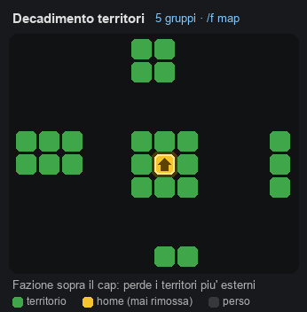

# MagixFactions

Plugin tipo **Factions** per Paper/Spigot. Questo documento è il **tutorial completo**
di tutto ciò che il plugin fa fino al **Modulo 3**.

---

## Indice
1. [Cos'è e cosa fa](#cosè-e-cosa-fa)
2. [Installazione](#installazione)
3. [Dipendenze](#dipendenze)
4. [Configurazione](#configurazione)
5. [Comandi](#comandi)
6. [Gradi e permessi](#gradi-e-permessi)
7. [Leader e successione](#leader-e-successione)
8. [Limite membri](#limite-membri)
9. [Chat](#chat)
10. [Database e migrazione](#database-e-migrazione)
11. [In arrivo](#in-arrivo)

---

## Cos'è e cosa fa
MagixFactions permette ai giocatori di creare **fazioni**, gestire **membri** e **gradi**,
con un sistema di **leader unico**, **successione automatica**, **chat dedicate** e
**storage intercambiabile** SQLite/MariaDB.

**Funzioni del Modulo 1:**
- Creazione fazione con **nome a lunghezza configurabile** e **costo configurabile**
  (soldi, oggetti, condizioni PlaceholderAPI, permessi).
- **Leader unico** = chi crea. Può **trasferire** il comando.
- **Successione automatica** quando il leader esce (al più alto in grado; a parità, a
  chi è in quel grado da più tempo — il tempo è salvato nel database).
- **Scioglimento automatico** se il leader è l'unico membro e fa `/f leave` → territori neutrali.
- **Gradi configurabili** (aggiungi/rimuovi, tag, permessi).
- **Permessi per grado e per singolo membro** (modifica via GUI: in arrivo).
- `/f promote` e `/f demote` (promozione fino a un gradino sotto il leader).
- **Chat** fazione / alleati / pubblica con `/f chat`.
- **Limite membri** configurabile (default 5), aumentabile con permessi VIP.
- **SQLite o MariaDB** + comando di **migrazione** tra i due.

---

## Installazione
1. Copia `MagixFactions-<versione>.jar` in `plugins/` (una sola versione per volta: cancella la vecchia).
2. Avvia il server: viene creato `plugins/MagixFactions/config.yml` e il database.
3. Configura a piacere e usa `/mf db ...` o `/f ...`.

> I driver SQLite/MariaDB sono **inclusi** nel jar: non devi installare nulla per il DB.

---

## Dipendenze
| Plugin | Obbligatorio | A cosa serve |
|---|---|---|
| **PlaceholderAPI** | consigliato | condizioni di creazione con placeholder (`%...%`) e placeholder forniti da noi |
| **Vault** + plugin economia | opzionale | costi in **soldi** (creazione, claim, banca di fazione) |
| **ProtocolLib** | opzionale | **minimap HUD** (pacchetti mappa + entità fittizie). Senza, la minimap si disattiva da sola |
| **LuckPerms** | opzionale | permessi dei giocatori **offline**: tetto di Potenza e velocità di perdita di chi non è collegato (vedi *Permessi VIP*) |
| **CMI** | opzionale | rilevato per la chat; nessuna funzione dipende da lui |

Tutte le dipendenze sono `softdepend`: **nessuna è obbligatoria per avviare**. Se manca Vault i costi in
denaro restano disattivi (avviso in console); senza PlaceholderAPI le condizioni con placeholder vengono
ignorate; senza ProtocolLib niente minimap; senza LuckPerms i valori dei giocatori offline restano quelli
già noti e la perdita va a velocità normale per tutti.

> Il **resource pack** della minimap non è un plugin: lo serve MagixFactions stesso da un piccolo server
> HTTP interno. Di serie è **obbligatorio** per i giocatori (`map.minimap.resourcepack.required`).

---

## Configurazione
File: `plugins/MagixFactions/config.yml`

### Nome fazione
```yaml
faction-name:
  min-length: 3
  max-length: 15     # lunghezza massima
  max-digits: 2      # massimo numero di cifre nel nome
```
Caratteri ammessi: **solo lettere e numeri** (niente spazi, underscore, simboli o punteggiatura),
al massimo **2 cifre**.

### Descrizione di default
Le nuove fazioni ricevono la descrizione `faction-description.default` (config), visibile in `/f info`.

### Parole vietate (filtro)
Nomi, descrizioni e (in futuro) ogni testo dei giocatori passano da un filtro anti-parolacce/offensivo.
La lista è in `config.yml` → **`forbidden-words`** (aggiungibile/rimuovibile). Il confronto ignora
maiuscole, leetspeak (`c4zz0`) e simboli/spazi, con match per sottostringa.

### Costo/condizioni di creazione
Tutto opzionale: lascia `0`/vuoto ciò che non vuoi.
```yaml
create-cost:
  money: 1000                       # richiede Vault
  items: ["DIAMOND:10", "EMERALD:3"]
  placeholders: ["%player_level% >= 10"]   # richiede PlaceholderAPI
  permission: "magixfactions.create"
```
Operatori condizioni: `>= <= > < == !=`.

Lo **stesso motore di costo** vale per **`/f sethome`** (sezione `sethome-cost`), di default **gratis**.

**`/f claim` ha un costo speciale**: la parte `money` di `claims.cost` è un **costo incrementale pagato
dalla banca di fazione** (non dal giocatore), formato `"base,incremento,blocco,moltiplicatore"`: il primo territorio
costa `base`, ognuno dei successivi `+incremento`, e ogni `blocco` territori base e incremento vengono
**moltiplicati** per il `moltiplicatore` (omesso = uguale al blocco). Esempio `"10,10,5,5"` → 10, 20, 30, 40, 50, 250, 300, 350, 400, 450,
2250, 2500, 2750… Forme brevi: `"0"` gratis, `"100"` fisso, `"10,10"` incremento senza blocchi.
Gli `items`/`placeholders`/`permission` di `claims.cost` restano requisiti del giocatore.

### Limite membri
```yaml
members:
  base: 5
```
Aumenti VIP: dai al leader il permesso `magixfactions.members.<numero>`
(es. `magixfactions.members.10` → fino a 10 membri).

### Gradi
Ordina dal **più basso** al **più alto** (il leader è sopra tutti).
```yaml
ranks:
  - id: recruit
    name: "Recluta"
    tag: "&7[R]"
    permissions: []
  - id: member
    name: "Membro"
    tag: "&a[M]"
    permissions: ["invite"]
  - id: officer
    name: "Ufficiale"
    tag: "&b[U]"
    permissions: ["invite", "kick", "promote", "demote"]

leader:
  name: "Leader"
  tag: "&6[L]"
```
Puoi aggiungere/rimuovere gradi liberamente. Permessi disponibili:
`invite, kick, promote, demote, relation, claim, unclaim, description, sethome, home, withdraw, *`.
`withdraw` = prelevare dalla **banca di fazione** (default: officer e leader); il versamento è aperto a tutti.

---

## Comandi
Comando base: `/f` (alias `/mf`, `/factions`, `/magixfactions`).

**L'elenco dei comandi** (`/f help`, oppure `/f` da solo) e' impaginato: otto righe per
volta, raggruppate per sezione (Fazione, Membri, Territorio, Diplomazia, Risorse, Staff),
con le frecce `‹ indietro · avanti ›` in fondo. **Ogni riga si clicca** e il comando
finisce nella barra della chat gia' scritto. `/f help 3` (o il numero da solo, `/f 3`)
salta direttamente a una pagina; la sezione *Staff* la vede solo chi ha
`magixfactions.admin`. Le voci si modificano in `messages.yml` sotto `help.sections` —
formato `"comando <argomenti> :: spiegazione"`. Stile, colori e prefisso sono quelli
comuni a tutti i plugin Magix: vedi `plugins-src/STILE-MAGIX.md`.

| Comando | Descrizione |
|---|---|
| `/f help [pagina]` | L'elenco dei comandi, a pagine e cliccabile (aperto a tutti) |
| `/f create <nome>` | Crea una fazione (paghi il costo, diventi leader) |
| `/f invite <gioc>` | Invita un giocatore (serve permesso `invite`) |
| `/f join <fazione>` | Entra se sei stato invitato |
| `/f claim` | Conquista il territorio (chunk) in cui ti trovi (perm. di rank `claim`, default leader) |
| `/f unclaim` | Rilascia il territorio in cui ti trovi; **rimborsa il 25%** (config `unclaim-refund-percent`) di quanto fu pagato, alla banca (perm. di rank `unclaim`) |
| `/f unclaimall` | Rilascia TUTTI i territori della fazione. **Irreversibile**: mostra un avviso a schermo, va rieseguito entro 10s per confermare (perm. di rank `unclaim`) |
| `/f map` | Mostra i territori attorno a te, colorati per relazione (aperto a tutti). Come risponde lo decide `map.mode`: **`chat`** (default) stampa la mappa testuale in chat, **`item`** consegna la **Mappa Fazioni**, un `filled_map` dinamico da tenere in mano |
| `/f sethome` | Imposta la home della fazione (dev'essere in un tuo territorio; perm. di rank `sethome`, default leader) |
| `/f home` | Teletrasportati alla home della fazione (perm. di rank `home`) |
| `/f leave` | Esci. Se sei l'unico leader → la fazione si scioglie |
| `/f promote <gioc>` | Sale di un grado (max un gradino sotto il leader) |
| `/f demote <gioc>` | Scende di un grado |
| `/f transfer <gioc>` | Passa il comando a un membro (solo leader) |
| `/f kick <gioc>` | Espelle un membro (serve permesso `kick`) |
| `/f chat [public\|faction\|ally]` | Cambia canale chat (senza argomento: cicla) |
| `/f ally <fazione>` (`/f a`) | Chiedi/accetta un'alleanza (serve permesso `relation`) |
| `/f enemy <fazione>` (`/f e`) | Sciogli l'alleanza / torna nemici (serve permesso `relation`) |
| `/f list` (`/f l`) | Elenca tutte le fazioni del server (per numero di membri) |
| `/f description <testo>` (`/f desc`) | Imposta la descrizione della fazione (max configurabile, default 100) |
| `/f deposit <soldi>` (`/f d`) | Versa i tuoi soldi nella **banca della fazione** (aperto a ogni membro; richiede un'economia Vault attiva) |
| `/f withdraw <soldi>` (`/f w`) | Preleva dalla banca della fazione (perm. di rank `withdraw`, default officer e leader) |
| `/f info [fazione]` | Mostra info della fazione (descrizione, potenza, territori, banca, relazioni) |
| `/f disband` | Scioglie la fazione (solo leader) |
| `/mf db info` | (admin) backend DB e conteggi |
| `/mf db migrate <sqlite\|mariadb>` | (admin) copia i dati nell'altro DB |
| `/mf admin setpower <gioc> <val\|reset>` | (admin) imposta la Potenza **attuale** (o `reset` al default). Il **tetto** non si imposta più da comando: è il permesso `magixfactions.power.powermax.<n>` |
| `/mf admin setmap <gioc> <zoom\|reset>` | (admin) imposta lo zoom mappa del giocatore (`closer\|closest..farthest` o `reset` al default). Se ha già una Mappa Fazioni in inventario (ed è online), lo zoom si aggiorna **sul posto**, senza rifare `/f map` |
| `/mf admin bypass [on\|off]` | (admin) attiva/disattiva il **tuo** bypass della protezione territori. Chi ha già `magixfactions.bypass`/`.admin` può spegnerlo un momento per testare come un giocatore normale, senza doversi togliere il permesso. Senza argomento: inverte lo stato attuale |
| `/mf admin home <fazione>` | (admin) teletrasporto alla home di **una fazione qualsiasi**, non solo la propria |
| `/mf admin disband <fazione>` | (admin) scioglie **una fazione qualsiasi**, senza doverne essere il leader |
| `/mf reload` | (admin) ricarica `config.yml` e `messages.yml` |

Permessi Bukkit: `magixfactions.use` (default: tutti), `magixfactions.admin` (default: op).

### Permessi VIP (LuckPerms) — i vantaggi si danno **così**, non da comando

| Permesso | Effetto | Esempio |
|---|---|---|
| `magixfactions.power.powermax.<numero>` | **Tetto di Potenza** del giocatore (default `power.max` = 10) | `magixfactions.power.powermax.20` → tetto 20 |
| `magixfactions.power.speed.<percentuale>` | **Velocità di recupero** della Potenza online; 100 = normale | `magixfactions.power.speed.200` → doppia (un punto ogni 5 min invece di 10) |
| `magixfactions.power.speed.loss.<percentuale>` | **Velocità di perdita** da offline; 100 = normale, più basso = perde più lentamente | `...speed.loss.50` → ci mette il doppio; `...loss.200` → perde il doppio; `...loss.0` → non perde mai |
| `magixfactions.minimap` | **Minimap HUD** nell'angolo dello schermo | — |
| `magixfactions.members.<numero>` | **Limite membri** della fazione (conta quello del **leader**) | `magixfactions.members.10` → fino a 10 membri |

- Fra più permessi dello stesso tipo vince il **più favorevole al giocatore**: il più **alto** per tetto e
  recupero, il più **basso** per la perdita. Se non ne ha nessuno valgono i valori di `config.yml`, quindi
  un numero scritto in un permesso fa sempre qualcosa — anche peggiorativo, se è l'unico che possiede.
- Nessuno dei tre è un'impostazione per-giocatore: si danno e si tolgono dal **gruppo** (es. quando un
  abbonamento VIP scade non resta nessun valore appiccicato al singolo giocatore da correggere a mano).
- Il cambiamento si applica **entro un giro** anche senza relog: `power.tick-seconds` (default 20s) per chi
  è collegato — tetto riallineato, minimap montata o smontata — e `power.offline-refresh-minutes`
  (default 10 min) per chi **non** lo è (vedi sotto).
- Chi vuole verificare il proprio vantaggio scrive `/f power`: se il recupero è diverso dal normale compare
  una riga in più con la percentuale e il tempo per punto.

---

## Gradi e permessi
- Ogni **grado** ha i suoi permessi (config).
- Il **leader** ha tutti i permessi (`*`).
- Sono previsti **override per singolo membro** (un membro può avere permessi extra/ridotti
  rispetto al suo grado): la modifica avverrà tramite **GUI in gioco** (prossimo step);
  il modello dati è già pronto.
- `/f promote` porta un membro al grado successivo, fino al **massimo un gradino sotto il leader**.
  Eseguendolo più volte, sale di più gradi.

---

## Leader e successione
- Il **leader è uno solo** ed è chi crea la fazione.
- `/f transfer <gioc>` cede il comando; il vecchio leader scende al grado più alto.
- Se il leader **esce** (`/f leave`) e ci sono altri membri, il comando passa **in automatico**
  al **più alto in grado**; a parità di grado, a chi è in quel grado **da più tempo**
  (il `rank_since` è salvato nel database).
- Se il leader è **l'unico membro** e fa `/f leave`, la fazione viene **sciolta** e i suoi
  **territori tornano neutrali**.

---

## Limite membri
- Limite base configurabile (default **5**).
- Aumentabile con permessi VIP del leader (`magixfactions.members.<n>`).
- In futuro: aumento tramite **missioni/soldi/condizioni**.

---

## Chat
`/f chat` cambia il tuo canale:
- **PUBBLICA**: chat normale del server.
- **FAZIONE**: messaggi visibili solo ai membri della tua fazione.
- **ALLEATI**: messaggi visibili alla tua fazione **e a tutte le fazioni alleate**.
  La riga mostra anche il nome della fazione di chi parla.

Senza argomento, il comando **cicla** tra i canali; oppure `/f chat faction` ecc.

---

## Relazioni (alleati / nemici)
Esistono **solo due** relazioni: **nemico** e **alleato**. Di **default ogni fazione è nemica
di tutte le altre**; nel database si memorizzano solo le alleanze.

- **`/f ally <fazione>`** — chiede un'alleanza. Diventa effettiva solo quando **anche l'altra**
  fazione fa `/f ally <tua_fazione>`. Solo da alleati potete usare la **chat alleati**.
- **`/f enemy <fazione>`** — riporta alla relazione di default (nemico). È **immediato** e serve a:
  - **sciogliere un'alleanza** (basta una delle due fazioni; vale per entrambe);
  - **annullare** una tua richiesta di alleanza in sospeso, o **rifiutare** quella ricevuta.

Alias brevi: `/f a`, `/f e`.

Chi può gestire le relazioni? Chi ha il permesso di grado **`relation`** (il leader sempre;
di default anche l'**Ufficiale**). Configurabile in `config.yml`.

Limite alleati: `relations.max-allies` (0 = illimitato).

`/f info` (sulla **propria** fazione) mostra in fondo le richieste di **alleanza** inviate/ricevute in sospeso
(i nemici non si elencano: sono tutte le altre fazioni). `/f info [fazione]` mostra il numero di
alleati e, se guardi un'altra fazione, la tua relazione con essa.

---

## Potenza & Territori (Modulo 3)

### Potenza (Power)
Ogni giocatore ha una **Potenza** intera, da `-max` a `+max`. Al primo ingresso parte da **0**.
- Il **tetto** è `power.max` (default **10**), alzato dal permesso VIP `magixfactions.power.powermax.<n>`.
  La Potenza **attuale** si corregge con `/mf admin setpower`.
- Sale di `power.gain-amount` (default **+1**) ogni `power.gain-interval-seconds` (default **600s**) **online**,
  alla velocità normale. Il permesso `magixfactions.power.speed.<percentuale>` la moltiplica: `200` = doppia
  (un punto ogni 5 minuti), `150` = una volta e mezzo.
- Alla **morte** perde `power.death-loss` (default **4**), fino a un minimo di `-max`.
- **Offline** decade di `power.offline-decay.amount` per `hour|day|week|month` (di serie **1 al giorno**), alla
  velocità dettata da `magixfactions.power.speed.loss.<percentuale>`: il periodo effettivo è
  `unità × 100 / percentuale`, quindi con 1 al giorno il `50` perde 1 ogni 48 ore e il `200` ne perde 2 al
  giorno. Il calo avviene **mentre il giocatore è via**, non tutto in blocco al suo rientro.

> **Come è contato il recupero.** Un unico task gira ogni `power.tick-seconds` (default **20s**) e fa avanzare
> ogni giocatore online del suo passo personale (`tick-seconds x velocità%`); al raggiungimento di
> `gain-interval-seconds` scatta il punto di Potenza. Conseguenze pratiche: il tempo **non dipende più dal
> momento in cui ti sei collegato** (col vecchio timer unico chi entrava un attimo prima dello scoccare
> prendeva il punto in regalo), e l'avanzamento a metà strada è **salvato sul database** (colonna
> `players.power_progress`), quindi chi si scollega a 7 minuti dai 10 riprende da lì e non da zero.
> Lo stesso giro riallinea **tetto di Potenza e minimap** ai permessi del momento: dare o togliere un VIP a
> giocatore collegato si vede entro pochi secondi, senza relog.

> **Il giro sui giocatori OFFLINE** (`power.offline-refresh-minutes`, default 10 min) è il gemello del
> precedente per chi non è collegato, e fa due cose che prima potevano avvenire solo al rientro:
> riallinea il **tetto** ai permessi e applica il **decadimento** maturato. Il primo serve perché il
> maxpower di fazione è la somma dei tetti di **tutti** i membri: senza, un VIP scaduto su un account che
> non rientra più regalerebbe tetto alla sua fazione per sempre. Il secondo fa sì che la Potenza di una
> fazione di assenti cali in tempo reale, e che la fazione diventi raidabile quando deve.
>
> **Cambiare `offline-decay` a server acceso** basta `/mf reload`: i valori sono riletti a ogni giro. Il
> conto riparte dall'ultimo periodo già maturato, quindi nessuno viene addebitato due volte e la Potenza
> già persa non torna indietro. Attenzione se **accorci** il periodo: chi è via da molto tempo può
> incassare più perdite tutte insieme al primo giro. Un valore di `per` non riconosciuto ripiega sul
> **giorno** e lo segnala in console (prima finiva zitto sull'ora, cioè 24 volte più veloce).

> I permessi di chi è offline li sa solo **LuckPerms** (Bukkit risponde solo per i giocatori online),
> quindi il plugin usa la sua API — dipendenza **opzionale**: la lettura sta tutta in un task asincrono
> (tocca lo storage di LuckPerms) e sul main thread torna solo l'applicazione dei valori. Senza LuckPerms
> il giro continua a funzionare, ma col tetto già in cache e la perdita a velocità normale per tutti.

La **Potenza di fazione** è la somma delle Potenze dei membri; il **maxpower di fazione** la somma dei loro max.
Questo è anche il motivo per cui il tetto di ogni giocatore resta **scritto sulla riga `players`** pur essendo
deciso dai permessi: serve anche per i membri **offline** (i cui permessi non sono interrogabili), quindi la
colonna è la **copia** dell'ultimo valore visto, aggiornata all'ingresso e a ogni giro del task Potenza.

> **Rilettura al login:** ad ogni ingresso, la riga `players` (potenza, maxpower, zoom mappa, nome) viene
> riletta dal database (in async, non blocca il tick) invece di fidarsi solo della cache in memoria. Questo
> fa sì che eventuali modifiche fatte **direttamente sul database** (es. a mano via SQLite mentre il server
> è acceso) si riflettano al rientro del giocatore, senza dover riavviare il server. Fa eccezione il
> **maxpower**, che all'ingresso viene comunque riportato a quello che dicono i permessi. Se aveva già una Mappa
> Fazioni in inventario, la scala si aggiorna di conseguenza (come `/mf admin setmap`). **Non vale** per le
> tabelle di fazione (membri, gradi, relazioni, territori): quelle restano in cache dall'avvio finché non
> passano dai comandi del plugin o da un riavvio — un refresh sicuro anche per quelle è più delicato
> (struttura a cache incrociata) e non ancora implementato.

### Territori (claim)
`/f claim` conquista il **chunk** in cui ti trovi. Permesso interno di rank **`claim`** (default: **solo il leader**;
nei prossimi moduli sarà assegnabile a rank/membri). Il costo è come `/f create` (config `claims.cost`, default **gratis**).

**Mondi consentiti** — i territori si possono rivendicare solo nei mondi elencati in `claims.allowed-worlds`
(default: **`world`**). Negli altri mondi (Nether, End…) `/f claim` viene rifiutato. Lista **vuota** = nessuna
restrizione (si claima ovunque).

**Area protetta dello spawn** (`claims.protected-spawn`) — un quadrato centrale (default: mondo `world`,
centro `0,0`, semilato `radius` **500** → da −500 a +500) in cui **non** si possono **fondare fazioni**
(`/f create`) né **conquistare territori** (`/f claim`): i giocatori devono uscirne per stabilire la base.
**I blocchi NON sono protetti**: dentro l'area si costruisce e si rompe liberamente come nel survival, è
solo l'attività di fazione a essere bloccata. `enabled: false` disattiva del tutto la zona.

**Territorio neutrale** — serve:
1. territori posseduti **<** tetto = `floor(maxpowerFazione × claims.max-percent/100)` (default **20%**);
2. **Potenza attuale della fazione > territori posseduti**.

**Territorio nemico (overclaim)** — oltre alle condizioni sopra:
3. la fazione nemica deve essere **raidabile**: la sua Potenza attuale **< suoi territori**;
4. il chunk deve essere **il più esterno** (almeno un chunk adiacente non è di quella fazione): non si conquista dall'interno.

In `/f info` compaiono **Potenza**, **Territori** e la riga **Stato** `territori/potenza/max`, **verde** se la fazione è
al sicuro (`potenza ≥ territori`), **rossa** se è **raidabile** (`potenza < territori`).

**Rilasciare territori:** `/f unclaim` rende neutrale il **chunk** in cui ti trovi (permesso di rank **`unclaim`**,
default **solo il leader**, gratis). `/f unclaimall` rilascia **tutti** i territori della fazione in un colpo solo:
è **irreversibile**, quindi il primo utilizzo mostra solo un **avviso a schermo** (titolo rosso + suono di pericolo,
config `claims.unclaim-all-confirm-sound`) — bisogna **rieseguire il comando** entro
`claims.unclaim-all-confirm-seconds` (default **10s**) per confermare davvero.

### Sovraccarico territori
Se una fazione possiede **più territori del tetto** (es. dopo aver perso un membro il cap scende), i membri online
ricevono un **titolo + suono di pericolo** ripetuto (config `decay.warn-interval-seconds`). Trascorse
`decay.grace-hours` (default **48h**) la fazione perde **1 territorio ogni** `decay.loss-interval-hours`
(default **24h**). Timer persistente. *(I vecchi nomi `overclaim.*` restano letti come ripiego, vedi `DecayManager.cfgInt`.)*

**Quando si ferma.** Non è una punizione a tempo: la perdita si arresta appena
`territori posseduti <= cap`, con `cap = floor(maxpower di fazione × claims.max-percent/100)` (default **20%**).
Quindi la si ferma alzando il cap (**invitando un membro**) o abbassando i territori (**`/f unclaim`**).
> ⚠️ **Da non confondere con la raidabilità**, che è un'altra soglia e guarda un altro numero: il decadimento
> guarda il **maxpower**, l'essere attaccabili guarda la **Potenza attuale** (`potenza < territori` = raidabile).
> Una fazione in pieno decadimento può essere **non** raidabile, e viceversa.

**I numeri nelle guide sono presi dal config, non scritti a mano.** Il tutorial dei giocatori
(`docs/build_tutorial.py` → `tutorial.html`) e il capitolo della **guida per lo staff** sul sito contengono
segnaposto — `{{cfg:power.max}}`, `{{secondi:power.gain-interval-seconds}}`, `{{ore:decay.grace-hours}}`,
`{{percento:claims.max-percent}}` — che il plugin sostituisce **all'avvio** leggendo il `config.yml` vero
(`util/ConfigValues` + `MagixFactions.guideValues()`). Quindi cambiando una chiave del config, guida e
tutorial si aggiornano **da soli** al riavvio successivo: non possono più raccontare valori vecchi.
- Per una chiave nuova **non serve toccare il codice Java**: basta scrivere il segnaposto nel testo.
- Anche i **pezzi di testo** che valgono solo in certe configurazioni seguono il config, con i blocchi
  condizionali `{{se:map.mode=chat}} ...testo... {{/se}}` (con `!=` per «in tutti gli altri casi»): il blocco
  **sparisce** se la chiave dice altro. È così che il capitolo della mappa racconta la mappa **in chat** o la
  mappa-**item** a seconda di `map.mode`, invece di descrivere per sempre quella in uso il giorno in cui è
  stata scritta. I blocchi **si annidano** (si risolvono dal piu' interno in fuori): serve, perche' la
  frase sulla forma della minimap sta dentro il blocco della mappa in chat.
- `{{simbolo:map.chat.symbols.you}}` mette il valore **senza i codici colore** (`&f&l+` → `+`): serve per i
  simboli del config quando finiscono in un testo scritto.
- I testi *derivati* (frasi che cambiano forma — non un semplice «c'è / non c'è») si passano da
  `guideValues()` con `ConfigValues.extra(...)`, es. la perdita da offline con `amount: 0`.
- Un segnaposto senza valore resta visibile come `{{...}}` **e viene segnalato nel log** all'avvio.
- **La tabella «Impostazioni» della guida per lo staff elenca TUTTE le chiavi del config**, non piu' un
  gruppetto scelto a mano: chiave, valore in uso adesso e spiegazione presa dal **commento della chiave
  nel config**. Una chiave nuova e' documentata dal momento in cui esiste, senza toccare il codice.
- Il controllo `python plugins-src/check_config.py` ha una regola in piu' (**[6]**): rilegge il
  tutorial dei giocatori e segnala ogni **numero scritto a mano** che coincide con un valore del config
  — cosi' non si torna indietro. Ignora i numeri delle schermate di esempio e dei comandi di esempio,
  che numeri di config non sono.

**Cambiare i tempi a server acceso:** `decay.grace-hours` e `decay.loss-interval-hours` sono riletti a ogni
controllo, quindi basta `/mf reload`. Fa eccezione `decay.warn-interval-seconds`, che è il periodo con cui è
schedulato il task in `onEnable`: quello richiede un **riavvio**. Nel **tutorial dei giocatori**
(`docs/build_tutorial.py`) i numeri sono segnaposto e si aggiornano da soli; va messa mano al testo solo se
cambia la **regola**, non il valore.
Vengono persi sempre i chunk **più esterni**, cioè i più lontani dal **cuore** = la **`/f home`** (se impostata,
altrimenti il baricentro dei territori). Il chunk della home **non viene mai** rimosso. Con più gruppi di territori,
si consuma **prima il gruppo più lontano dalla home** (dai bordi verso l'interno), restringendo verso la home.



### `/f map` — due modalita' (`map.mode`)
`map.mode` decide come risponde il comando, ed e' l'unica cosa da cambiare per passare dall'una all'altra:

| `map.mode` | Cosa fa |
|---|---|
| **`chat`** *(default)* | Stampa in chat un quadrato centrato sul giocatore, grande quanto lo zoom `/f map`/minimap (stessa area in chunk, 128px/16blocchi×bpp): una **lettera** per fazione, colorata col `fill` della relazione, piu' la legenda lettera→fazione. Simboli in `map.chat.symbols` (`you` / `home` / `neutral`). Una casella e' normalmente un chunk; oltre `map.chat.max-rows` caselle per lato smette di crescere e ogni casella ne riassume piu' d'uno. E' una fotografia dell'istante: non si aggiorna da sola |
| **`item`** | Consegna la **Mappa Fazioni**, l'item dinamico descritto qui sotto |

Il **tutorial dei giocatori** segue questa chiave da solo (blocchi `{{se:map.mode=...}}`, vedi «I numeri nelle
guide»): cambiata la modalita', al riavvio il capitolo 8 della guida racconta quella giusta — non va toccato a mano.
La **minimap HUD** e' un extra a parte, legato al permesso `magixfactions.minimap`, e funziona con entrambe.

#### Mappa Fazioni (item) — `map.mode: item`
`/f map` in questa modalita' consegna un **item mappa** (`filled_map`) chiamato *Mappa Fazioni*. Tenendolo in mano,
disegna **sopra il terreno reale** (campionato e ombreggiato da noi, non dal terreno vanilla — vedi `TerrainCache`)
i territori delle fazioni: ogni regione è un'**area a tinta** (con un **bordo** più marcato che fa da cornice),
fusa col terreno per lasciarlo intravedere. I colori seguono la **tua relazione** con il proprietario: **own** =
tua, **ally** = alleata, **enemy** = nemica — **senza fazione propria sei nemico di tutti** (nessuno stato neutro,
coerente col resto del plugin). È **dinamica**: ti segue sempre, ricentrandosi molti tick al secondo così il
movimento è fluido invece di "scattare" (config `map.item.render-interval-ticks`).

Configurazione in `config.yml` → `map`:
- Zoom per-giocatore (`/mf admin setmap <gioc> <zoom>`) — `CLOSER | CLOSEST | CLOSE | NORMAL | FAR | FARTHEST`. **CLOSER** è un livello extra più ravvicinato del vanilla "closest" (0.5 blocchi/pixel invece di 1: mostra un'area della metà, coi dettagli raddoppiati).
- `map.item.opacity` / `map.item.opacity-borders` — opacità % di interno/bordo dei territori (0 = invisibile, 100 = colore pieno). Default **40** / **60**.
- `map.item.render-interval-ticks` — ogni quanti tick (1/20s) si ricentra/ridisegna. Default **5**.
- `map.colors.own / ally / enemy` — colori `border`/`fill` per relazione.
- `map.home-marker.enabled` / `.color` — simbolo di casa al **centro del chunk home** della propria fazione (se impostata e nello stesso mondo). Mostrato sia qui che nella minimap HUD (stesso motore di disegno condiviso). Default: attivo, colore oro (`&6`).

**Marcatore giocatore (freccia nitida su ENTRAMBE le mappe).** Ogni giocatore è una **freccia** che punta verso dove guarda, colorata per relazione con chi tiene la mappa: **bianca = tu**, **verde = compagno di fazione**, **blu = alleato**, **rossa = nemico** (stile Cartographer). La freccia **resta nitida a qualsiasi angolo** (a 30/45° non si sgrana) perché è disegnata a risoluzione schermo. Per un limite tecnico di Minecraft è resa in due modi diversi ma con lo stesso aspetto: sulla **mappa-item** in mano sono i **cursori nativi** del client; sulla **minimap HUD** (pixel spinti via pacchetto+shader, dove i cursori nativi non si agganciano) le stesse frecce le ridisegna lo **shader** (fino a 6: i giocatori più vicini + sempre te stesso al centro). **Nessun nome** viene mostrato: sulle mappe compare solo la freccia indicatrice.

> **La mappa è personale e unica:** `/f map` **sostituisce sempre** qualunque Mappa Fazioni tu abbia già in
> inventario (non se ne può avere più di una) e viene taggata con il **tuo UUID**: se la regali o la fai tenere a
> un altro giocatore, per lui **non funziona** (niente overlay territori, resta un item mappa qualunque) — solo il
> proprietario originale la vede funzionante. Se l'inventario è pieno (anche dopo aver liberato lo slot di
> un'eventuale mappa vecchia), **non viene creata**: un messaggio ti chiede di liberare uno slot e rieseguire
> `/f map`.

### Minimap HUD (sperimentale) — permesso `magixfactions.minimap`
Overlay **fisso nell'angolo dello schermo** (non un item in mano): un quadro fittizio invisibile, montato sul
giocatore via ProtocolLib, che mostra la stessa mappa territori centrata su di lui. Uno **shader** distribuito
tramite **resource pack** (servito da un piccolo server HTTP integrato al plugin, nessun hosting esterno richiesto)
riposiziona il contenuto a schermo. Spetta a chi ha il permesso **`magixfactions.minimap`** (di serie nessuno:
si dà al gruppo VIP): si monta da sola al login, dopo `/reload` e **anche a giocatore già collegato** entro un
giro di `power.tick-seconds`; tolto il permesso, si smonta da sola nello stesso modo. Richiede **ProtocolLib** installato
(si disattiva da sola, senza errori, se manca) e la porta del resource pack (`map.minimap.resourcepack.port`,
default **8443**) raggiungibile dai client — va aperta sul firewall del server.

- **Marcatore giocatore (freccia disegnata dallo shader):** il PROPRIO marcatore e' una **freccia bianca
  con contorno nero** disegnata direttamente dallo **shader** al centro della minimap — a risoluzione
  schermo, quindi **nitida e con rotazione fluida** verso dove si guarda (i cursori-mappa nativi, usati sulla
  mappa-item, non si possono agganciare alla minimap HUD: il client li disegnerebbe alla posizione reale
  dell'item fittizio, non seguono lo shader — quindi qui la freccia la disegna lo shader stesso, leggendo lo
  yaw del giocatore da un "quadrante" codificato nell'header). **Ogni altro giocatore** online nell'area
  visibile e' invece ancora "cotto" nei pixel: il proprio volto (skin) bordato di un colore secondo la
  relazione (`map.colors.<rel>.border`): verde = compagno di fazione, magenta = alleato, rosso = nemico
  (nessuno stato neutro, coerente col resto del plugin).
- **Nitidezza:** il contenuto della minimap e' campionato **nearest** (pixel netti), come la mappa-item —
  la versione precedente usava un filtro bilineare che la faceva sembrare "annebbiata"/sfocata.
- **Punti cardinali:** N/S/O/E disegnati ai bordi (la minimap non ruota, il nord e' sempre in alto).
- **Area visibile / zoom:** SEMPRE identica allo zoom `/f map` del giocatore (`closer/closest/close/normal/far/farthest`,
  `/mf admin setmap`) — non è un valore indipendente, si aggiorna da sola se lo zoom della mappa cartacea cambia
  mentre la minimap è già attiva.
- **Frequenza di aggiornamento:** `map.minimap.render-interval-ticks` (default **1** = 50ms). Più basso = più
  fluido ma più carico.
- Il terreno mostrato (sia qui che nell'item `/f map`, che condividono la stessa cache) si aggiorna **subito**
  quando un blocco viene piazzato o rotto — non aspetta più il refresh naturale della cache (fino a 3 minuti).

### Resource pack obbligatorio
Il pacchetto risorse servito dal plugin è **obbligatorio**: viene inviato a **ogni giocatore al join** (non
più solo a chi ha la minimap) con il flag *richiesto* del protocollo — il client vanilla in quel caso non
mostra nemmeno il tasto "No". Poiché quel flag lo rispetta il **client** (e il download può comunque
fallire), la rete di sicurezza è lato server: chi **non carica** il pacchetto viene **espulso** con un
messaggio configurabile.

Casi gestiti (`config.yml` → `map.minimap.resourcepack`):

| Esito riportato dal client | Cosa succede | Messaggio |
|---|---|---|
| Caricato correttamente | Gioca normalmente | — |
| **Rifiutato** dal giocatore | Espulso | `kick-messages.declined` |
| **Download fallito / URL non valido / applicazione fallita / pacchetto rimosso** | Espulso | `kick-messages.failed` |
| **Nessuna risposta** entro `timeout-seconds` (default 30 s) | Espulso | `kick-messages.timeout` |
| In corso (accettato / scaricato) | Il conto alla rovescia **riparte** (le linee lente non vengono punite) | — |

- `required: true|false` — **true** (default) = obbligatorio come sopra; **false** = comportamento vecchio
  (facoltativo, inviato solo a chi ha la minimap HUD, nessuna espulsione).
- `prompt` — testo della richiesta mostrata dal client. `timeout-seconds: 0` disattiva il timeout.
- `send-delay-ticks` (default **20** = 1 s) — attesa dopo l'ingresso prima di chiedere il pacchetto.
- I messaggi supportano i **codici colore `&`** e `\n` per andare a capo.

> **Salvaguardie anti-lockout.** Chi ha `magixfactions.resourcepack.bypass` (default **op**) riceve il
> pacchetto ma **non viene mai espulso**, e se il server HTTP interno non è partito (`public-host` vuoto,
> porta occupata) **nessuno** viene espulso. Se i download falliscono di continuo, la console avvisa con
> l'URL da verificare: quasi sempre è la **porta `map.minimap.resourcepack.port` chiusa sul firewall**.

### Titoli territorio
Quando **entri** in una zona appare un titolo al centro dello schermo (fade-in), distinto per relazione con la
fazione proprietaria: proprio (`own`), alleato (`ally`), nemico (`enemy`) o **neutrale** (`neutral`). Mostrando sempre
la zona in cui *entri*, uscendo dalla tua terra verso il nulla leggi "zona neutrale" invece di un addio alla tua
fazione. Testi e tempi in `config.yml` → `territory-titles` (`{faction}` = nome fazione proprietaria); disattivabile
con `enabled: false`.

---

## Database e migrazione
- `storage.type: sqlite` (file, zero installazione) **oppure** `mariadb`.
- Per spostare i dati da un DB all'altro:
  1. `/mf db migrate <sqlite|mariadb>` (copia **tutti** i dati)
  2. cambia `storage.type` nel config
  3. riavvia il server
- La migrazione è **generica**: continuerà a funzionare quando aggiungeremo nuove tabelle.

---

## Placeholder forniti (PlaceholderAPI)
MagixFactions registra un'espansione PlaceholderAPI: questi placeholder funzionano
in **qualsiasi** plugin/config che usi PlaceholderAPI (CMI, scoreboard, tab, ecc.).

| Placeholder | Significato |
|---|---|
| `%magixfactions_faction%` | Nome della fazione del giocatore (vuoto se nessuna) |
| `%magixfactions_factionstot%` | Numero totale di fazioni |
| `%magixfactions_rank%` | Tag del grado del giocatore |
| `%magixfactions_leader%` | Nome del leader della fazione |
| `%magixfactions_members%` | Numero di membri della fazione |
| `%magixfactions_allies%` | Numero di fazioni alleate |
| `%magixfactions_enemies%` | Numero di fazioni nemiche |
| `%magixfactions_power%` | Potenza attuale della fazione |
| `%magixfactions_maxpower%` | Potenza massima della fazione |
| `%magixfactions_claims%` | Territori posseduti dalla fazione |
| `%magixfactions_maxclaims_fazione%` | Tetto territori attuale (20% del maxpower) |
| `%magixfactions_power_player%` | Potenza del singolo giocatore |
| `%magixfactions_maxpower_player%` | Potenza massima del singolo giocatore |
| `%magixfactions_relation_<fazione>%` | Relazione (testo) di chi legge verso la fazione indicata |

### Placeholder relazionale (colore)
| Placeholder | Significato |
|---|---|
| `%rel_magixfactions_relation_color%` | Colore che un giocatore vede verso un **altro** giocatore in base alla relazione fra le loro fazioni |

Questo è un **placeholder relazionale** (prefisso `rel_`): dipende da **due** giocatori, quindi
funziona solo dove PlaceholderAPI fornisce il contesto relazionale — tipicamente nei
**groupformat di chat di CMI**. Il colore per ogni relazione si configura in `config.yml`:

```yaml
relations:
  colors:
    member: "&a"      # stessa fazione
    ally: "&d"        # alleata
    enemy: "&c"       # nemica
    none: "&f"        # giocatore senza fazione
  names:              # testo per %magixfactions_relation_<fazione>%
    member: "&aStessa fazione"
    ally: "&dAlleata"
    enemy: "&cNemica"
    none: "&7Senza fazione"
```
Supporta i codici `&` e gli esadecimali `&#RRGGBB`.

Richiede PlaceholderAPI installato. Verifica con `/papi list` (deve comparire `magixfactions`).

## In arrivo
Moduli successivi (da pianificare insieme):
- `/f claims` (elenco dei territori posseduti).
- **GUI** (chest) per modificare permessi di gradi e singoli membri.
- **Classifiche**, **missioni**.

*(Già fatti, non più in arrivo: protezione territori — vedi la sezione dedicata —, home di fazione
`/f sethome`/`/f home` e banca di fazione `/f deposit`/`/f withdraw`.)*

> ✅ **Modulo 3 completato:** sistema **Potenza** (accrescimento online, perdita a morte, decadimento offline),
> **`/f claim`** territori (neutrali + overclaim dei nemici raidabili sul bordo, costo come create),
> tetto territori dal maxpower, stato sicura/raidabile in `/f info`, placeholder power/maxpower/claims.
> **`/f map`** come **item Mappa Fazioni** dinamico (overlay territori sul terreno, v0.10.0) e **titoli**
> centro-schermo entrando/uscendo dai territori nemici (v0.5.0).
